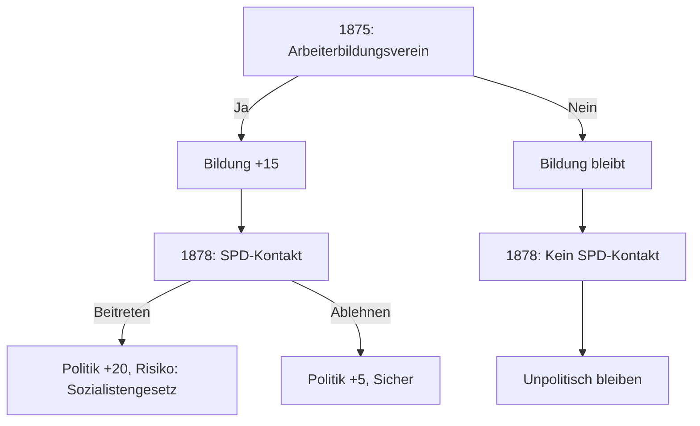

# Entscheidungssystem für Schicksalswege

## Konzept

Jede Entscheidung basiert auf **realen biografischen Wendepunkten**. Wir fragen: 
> "Was wäre passiert, wenn diese Person anders entschieden hätte?"

## Struktur

```
entscheidungen/
├── README.md                    # Diese Datei
├── VARIABLEN.md                 # Tracking-Variablen (Bildung, Politik, etc.)
├── arbeiter/
│   ├── STORYLINE.md             # Haupt-Entscheidungsbaum
│   ├── 1871-1880.md             # Detaillierte Szenen
│   ├── 1881-1890.md
│   └── ...
├── buerger/
│   └── ...
├── juedisch/
│   └── ...
└── adel/
    └── ...
```

## Entscheidungs-Syntax

Jede Entscheidung folgt diesem Format:

```markdown
### [JAHR] Entscheidungstitel
**Quelle:** [Biografie, aus der der Moment stammt]
**Alter des Protagonisten:** [Alter]
**Kontext:** [Situation]

> [Zitat oder Beschreibung der Situation]

**Optionen:**
1. **[Option A]** → Auswirkung sofort, Auswirkung langfristig
2. **[Option B]** → Auswirkung sofort, Auswirkung langfristig

**Variablen-Änderung:**
- Option A: Politik +10, Bildung +5
- Option B: Vermögen +5, Ansehen -5
```

## Variablen-System

Jede Familie trackt diese Werte (-100 bis +100):

| Variable | Bedeutung | Beispiel-Auswirkung |
|----------|-----------|---------------------|
| **Bildung** | Schulbildung, Selbststudium, Wissen | Berufschancen, politisches Bewusstsein |
| **Vermögen** | Erspartes, Eigentum, Einkommen | Krisenfestigkeit, Heiratschancen |
| **Politik** | Politische Radikalisierung | -100=Reaktionär, 0=Unpolitisch, +100=Revolutionär |
| **Gesundheit** | Körperliche Verfassung | Arbeitsfähigkeit, Lebenserwartung |
| **Ansehen** | Sozialer Status in der Gemeinschaft | Netzwerk, Heiratschancen, Beruf |
| **Solidarität** | Verbundenheit mit der Klasse/Gemeinschaft | Hilfe in Krisen, politische Unterstützung |

## Langzeit-Konsequenzen

Entscheidungen wirken über Generationen:

```
Generation 1 (1871-1890): Grundlagen legen
     ↓ Vererbung: 50% der Werte + Narrative
Generation 2 (1890-1914): Auf Grundlagen aufbauen
     ↓ Vererbung: 50% der Werte + Narrative
Generation 3 (1914-1933): Konsequenzen ernten
```

### Beispiel: Bildungs-Kette
```
1875: Vater besucht Arbeiterbildungsverein → Bildung +15
1885: Sohn darf Volksschule beenden (statt früher arbeiten) → Bildung +10
1900: Enkel kann Handwerkerlehre machen → Bildung +20, Vermögen +10
1920: Urenkel studiert (!) → Bildung +30, neuer sozialer Status
```

### Beispiel: Politik-Kette
```
1878: Vater versteckt verbotene Zeitungen → Politik +20, Risiko
1890: Sohn wird Gewerkschaftsfunktionär → Politik +15, Ansehen +10
1914: Enkel verweigert Kriegsbegeisterung → Politik +25, aber Ansehen -30
1918: Urenkel bei Revolution dabei → Schlüsselrolle möglich
```

## Quellen für Entscheidungen

| Biografie | Perspektive | Schlüsselentscheidungen |
|-----------|-------------|-------------------------|
| Bromme | Arbeiter (Fabrik) | SPD-Beitritt, Heirat, Krankheit |
| Baader | Arbeiterin (Näherin) | Politisierung, Frauenbewegung |
| Popp | Arbeiterin (Fabrik) | Bildung, Aktivismus |
| Viersbeck | Arbeiterin (Dienst) | Stellenwechsel, Würde vs. Geld |
| Bergg | Arbeiter (Kellner/Seemann) | Berufswahl, Abenteuerlust |
| Rehbein | Arbeiter (Land) | Landflucht, Militär |
| Schraut-Biografien | Bürgerin | Bildung, Ehe, Emanzipation |

## Mermaid-Diagramme

Für komplexe Verzweigungen nutzen wir Mermaid:



## Nächste Schritte

1. ✅ Struktur anlegen
2. 🔄 Arbeiter-Storyline 1871-1890 entwickeln
3. ⏳ Weitere Perspektiven
4. ⏳ Generationen-Übergänge
5. ⏳ Verknüpfung aller Stränge
