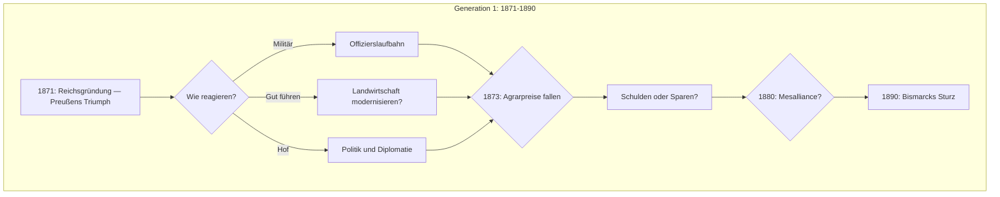

# Familie von Tresckow — Adel-Perspektive

## Das zentrale Dilemma

> *"Tradition bewahren oder modernisieren?"*

Der Adel im Kaiserreich steht vor:
1. **Wirtschaftlichem Druck** (Agrarpreise fallen, Konkurrenz aus Amerika)
2. **Statusverlust** (Bürgertum steigt auf)
3. **Der Moderne** (Industrie, Stadt, Demokratie)

## Biografische Grundlagen

| Quelle | Elemente |
|--------|----------|
| **Lily Braun** | Adelige wird Sozialistin — der extreme Bruch |
| **Dollinger** | Politische Rolle des Adels |
| **Allgemein** | Junker, Militär, Hofgesellschaft |

## Gesamtübersicht



## Start-Konfiguration (1871)

```yaml
protagonist:
  name: "Friedrich von Tresckow"
  geburtsjahr: 1840
  alter_1871: 31
  herkunft: "Brandenburg, Gut Dreibrücken"
  stand: "Junker"
  
attribute:
  bildung: 25       # Kadettenschule, evtl. Universität
  vermoegen: 40     # Gut, aber belastet
  politik: -30      # Konservativ
  gesundheit: 20    # Robust
  ansehen: 50       # Adelig!
  solidaritaet: 15  # Standesgenossen

flags:
  - IST_ADELIG
  
spezial:
  ehre: 80          # Adeliges Ehrgefühl
  tradition: 70     # Bindung an alte Werte
  schulden: 20      # Hypotheken auf dem Gut
```

---

## Kapitel 1: 1871-1880 — Der Triumph und sein Preis

### [1871-Q1] Sedan und Versailles
**Kontext:** Deutschland siegt. Der König wird Kaiser. Der Adel triumphiert.

**Szene:**
*Friedrich war dabei. Bei Sedan, bei der Belagerung von Paris, bei der Proklamation im Spiegelsaal.*

*"Wir haben es geschafft", sagt sein Vater, als er heimkehrt. "Ein deutsches Reich. Unter preußischer Führung. Unter UNSERER Führung."*

*Das Gut ist alt, das Dach leckt, die Schulden drücken. Aber der Name? Der Name glänzt.*

**Keine Entscheidung** — Triumph-Stimmung

---

### [1871-Q3] Die Rückkehr aufs Gut
**Kontext:** Friedrich muss entscheiden: Militär bleiben oder das Gut übernehmen?

**Szene:**
*Sein Vater ist alt. Das Gut braucht einen Herrn.*

*Aber die Kaserne, die Kameraden, die Ehre der Uniform...*

**Optionen:**

1. **Militärkarriere fortsetzen**
   - → Ansehen +15
   - → Ehre +10
   - → Aber: Gut vernachlässigt (Vermögen -5/Jahr)
   - → Verwalter nötig
   - → Weg zur Generalsepaulette

2. **Gut übernehmen**
   - → Vermögen stabilisiert
   - → Tradition +10
   - → Aber: Kein Militär-Prestige
   - → Muss wirtschaften lernen

3. **Beides versuchen (Reserve)**
   - → Kompromiss
   - → Beides halbherzig
   - → Erschöpfung (Gesundheit -5)

---

### [1872-Q2] Die Braut
**Kontext:** Zeit für eine standesgemäße Heirat.

**Szene:**
*Die Mutter hat Kandidatinnen. Alle adelig, alle passend, alle... langweilig.*

*Dann, bei einem Ball in Berlin, sieht Friedrich SIE. Keine Adelige. Die Tochter eines Fabrikanten. Schön, gebildet, und mit einer Mitgift, die alle Schulden tilgen würde.*

*Eine Mesalliance. Unstandesgemäß. Aber...*

**Optionen:**

1. **Standesgemäß heiraten (Adelige)**
   - → Ansehen +10
   - → Tradition +10
   - → Vermögen +10 (kleine Mitgift)
   - → Schulden bleiben
   - → Erwartete Wahl

2. **Mesalliance (Fabrikantentochter)**
   - → SKANDAL
   - → Ansehen -30 (bei Standesgenossen)
   - → Vermögen +50 (große Mitgift!)
   - → Tradition -20
   - → Familie entsetzt
   - → Aber: Freiheit gewonnen

3. **Ledig bleiben**
   - → Flexibel
   - → Aber: Wer erbt?

---

### [1873-Q3] Die Agrarkrise
**Kontext:** Der Gründerkrach trifft auch die Landwirtschaft. Billigeres Getreide aus Amerika überschwemmt den Markt.

> *Der transatlantische Getreidehandel ruiniert die deutschen Junker.*

**Szene:**
*Die Preise fallen. Was letztes Jahr 10 Taler brachte, bringt jetzt 7. Und die Kosten steigen.*

*"Wir müssen modernisieren", sagt der Verwalter. "Maschinen. Dünger. Neue Methoden."*

*"Das kostet Geld, das wir nicht haben."*

*"Oder wir verkaufen."*

**Optionen:**

1. **Modernisieren (Kredit aufnehmen)**
   - → Schulden +30
   - → Aber: Langfristig Ertrag +20%
   - → Risiko: Wenn es schiefgeht → Ruin

2. **Sparen und durchhalten**
   - → Schulden +10 (langsamer)
   - → Personal entlassen (Solidarität -10)
   - → Langsamer Abstieg

3. **Land verkaufen**
   - → Vermögen +20 (sofort)
   - → Tradition -30
   - → Ansehen -20
   - → Gut schrumpft

4. **An Industriellen verkaufen und bleiben als "Verwalter"**
   - → Vermögen +40
   - → Aber: Nicht mehr Herr im eigenen Haus
   - → Ehre -40

---

### [1876-Q2] Die Kinder
**Kontext:** Ein Sohn und eine Tochter. Was wird aus ihnen?

**Szene:**
*Der Sohn Albrecht, 5 Jahre alt, spielt Soldat. Natürlich.*

*Die Tochter Sophie, 3, sitzt still mit einer Puppe.*

*Friedrich denkt: Albrecht wird Offizier. Sophie wird heiraten. So war es immer.*

*Aber: Wird Albrecht genug Vermögen haben für den Offiziersstand? Wird Sophie einen passenden Mann finden in einer Welt, wo der Adel verarmt?*

→ Flag: HAT_KINDER
→ Kinder: Albrecht (1871), Sophie (1873)

---

### [1878-Q1] Der Bund der Landwirte — Vorläufer
**Kontext:** Die Junker organisieren sich. Sie fordern Schutzzölle.

> *"Schutz der nationalen Arbeit" — aber gemeint ist: Schutz des Adels*

**Szene:**
*Ein Treffen in der Kreisstadt. Andere Gutsbesitzer. Alle haben dieselben Probleme.*

*"Wir brauchen Zölle", sagt einer. "Das amerikanische Getreide muss teurer werden."*

*Ein anderer: "Und was ist mit den Arbeitern? Die wollen billiges Brot."*

*Schweigen.*

**Optionen:**

1. **Aktiv für Schutzzölle kämpfen**
   - → Politik +10 (konservativ)
   - → Netzwerk mit anderen Junkern
   - → 1879: Erfolg! Bismarck führt Zölle ein

2. **Passiv abwarten**
   - → Profitiert von Zöllen (wenn sie kommen)
   - → Aber: Kein Einfluss

3. **Kritisch sein ("Die Arbeiter brauchen billiges Brot")**
   - → Ansehen -20 (bei Standesgenossen)
   - → Aber: Liberaler Ruf
   - → Zugang zu anderen Kreisen

---

### [1879-Q3] Die Schutzzölle kommen
**Kontext:** Bismarck führt Schutzzölle ein. Die Junker atmen auf.

**Szene:**
*Die Preise stabilisieren sich. Nicht mehr die goldenen Zeiten, aber: Überleben gesichert.*

*Friedrich trinkt mit den Nachbarn auf Bismarck. Der Retter.*

*Aber: Im Dorf murren die Leute. Das Brot ist teurer geworden.*

**Keine Entscheidung** — Konsequenz

---

### [1880-Q2] Die Offizierskarriere des Sohnes
**Kontext:** Albrecht ist 9. Zeit, an seine Zukunft zu denken.

> *Die Offizierskarriere war DER Weg für adelige Söhne. Aber sie kostete Geld.*

**Szene:**
*Albrecht will zur Kavallerie. Natürlich. Die teuerste Waffengattung.*

*"Ein Leutnant bei den Kürassieren braucht 300 Taler im Monat — der Sold ist 120."*

*Kann Friedrich sich das leisten?*

**Optionen:**

1. **Kadettenschule, dann Kavallerie**
   - → Albrecht: Ansehen +30
   - → Vermögen -15/Jahr
   - → Tradition +20
   - → Albrecht: Der standesgemäße Weg

2. **Kadettenschule, dann Infanterie**
   - → Albrecht: Ansehen +15
   - → Vermögen -5/Jahr
   - → Kompromiss

3. **Universität statt Militär**
   - → Albrecht: Bildung +25
   - → Tradition -20
   - → Neue Wege möglich
   - → Aber: Entehrend?

4. **In die Wirtschaft (unerhört!)**
   - → Albrecht: Vermögen langfristig +30
   - → Tradition -40
   - → Ansehen -30
   - → Aber: Die Zukunft?

---

## Kapitel 2: 1881-1890 — Die alten Zeiten enden

### [1885-Q2] Die Tochter heiraten
**Kontext:** Sophie ist 12. In ein paar Jahren...

**Szene:**
*Friedrich macht sich Sorgen. Sophie ist klug, schön, liebenswert. Aber ihre Mitgift wird klein sein.*

*Die guten adeligen Partien werden seltener. Der Adel verarmt.*

*Oder: Ein reicher Bürgerlicher? Das wäre früher undenkbar gewesen...*

**Noch keine Entscheidung** — Vorbereitung für Generation 2

---

### [1888-Q1] Das Dreikaiserjahr
**Kontext:** Wilhelm I. stirbt. Friedrich III. stirbt. Wilhelm II. kommt.

**Szene:**
*Friedrich von Tresckow stand Wache am Sarg Wilhelm I. Er hat unter ihm gedient, für ihn gekämpft.*

*Jetzt: Ein neuer Kaiser. Jung, ungestüm, mit Ideen.*

*"Der neue Kurs", sagen manche. Was bedeutet das für den Adel?*

**Keine Entscheidung** — Stimmungsbild

---

### [1890-Q1] Bismarcks Sturz
**Kontext:** Der Kanzler, der alles gebaut hat, wird entlassen.

**Szene:**
*Friedrich kann es nicht fassen. Bismarck — entlassen? Von einem Kaiser, der ohne ihn nichts wäre?*

*"Die Zeiten ändern sich", sagt seine Frau.*

*Ja. Die alten Zeiten enden. Was kommt, weiß niemand.*

**Markiert ENDE GENERATION 1**

---

## Übergang zu Generation 2

### Albrecht übernimmt

**Basis-Werte (aus Generation 1):**
```
Albrechts Vermögen = (Vater Vermögen × 0.5) - Schulden
Albrechts Ansehen = (Vater Ansehen × 0.7) + Militärkarriere
Albrechts Tradition = (Vater Tradition × 0.6) + Erziehung
```

**Neue Herausforderungen (1890-1914):**
- Sozialdemokratie wächst
- Industrialisierung beschleunigt sich
- Adel verliert politischen Einfluss
- Wilhelm II.s erratische Politik

---

## Langzeit-Konsequenzen

### Traditions-Pfad → 1918
```
1871: Militärkarriere gewählt
      ↓
1890: Sohn wird Offizier
      ↓
1914: Enkel zieht in den Krieg
      ↓
1916: Enkel fällt bei Verdun
      ↓
1918: Kein Erbe. Revolution. Gut verloren.
```

### Modernisierungs-Pfad → 1918
```
1873: Gut modernisiert
      ↓
1890: Sohn studiert Agrarwissenschaft
      ↓
1914: Gut produziert kriegswichtige Güter
      ↓
1918: Revolution — aber Besitz bleibt
      ↓
1920: Weimarer Republik: Überlebt als "Landwirt"
```

### Mesalliance-Pfad → Flexibilität
```
1872: Fabrikantentochter geheiratet
      ↓
1890: Kinder haben Kontakte in beide Welten
      ↓
1918: Können sich anpassen
      ↓
1933: ???
```

---

## Besondere Spielmechanik

### Ehre-Meter (0-100)
- Beeinflusst was "möglich" ist
- Hohe Ehre = weniger Optionen, aber Respekt
- Niedrige Ehre = mehr Optionen, aber Ausschluss

### Schulden-Meter (0-100)
- Steigt durch Ausgaben
- Bei 100: Bankrott, Gut versteigert

### Tradition vs. Moderne
- Ständiger Konflikt
- Keine "richtige" Antwort
- 1918 zeigt: Tradition allein reicht nicht
