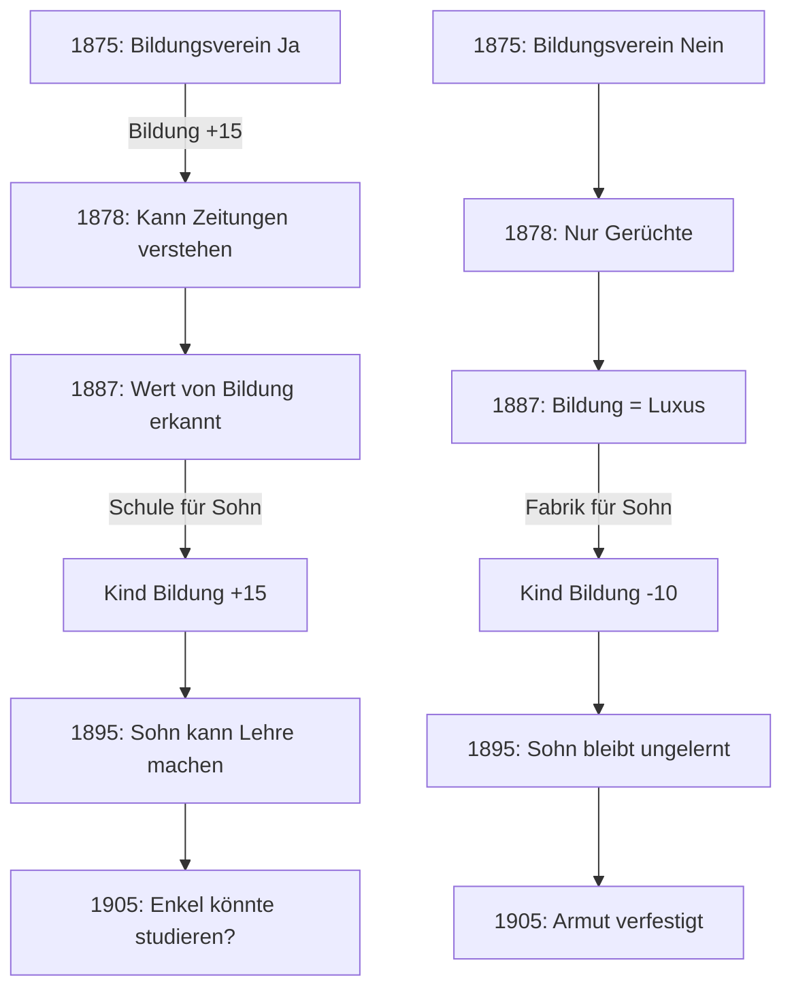
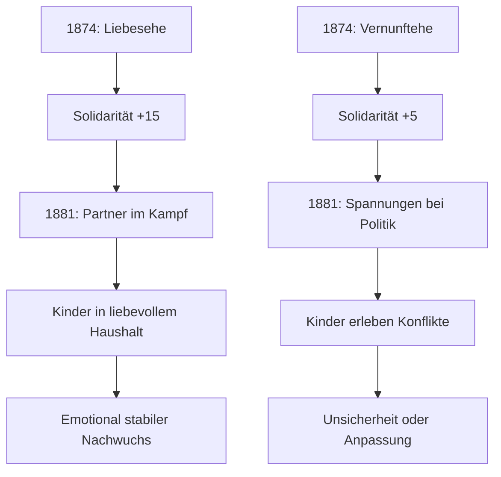

# Langzeit-Konsequenzen — Arbeiter-Pfad

## Wie frühe Entscheidungen spätere Generationen beeinflussen

---

## Entscheidungsketten

### Kette 1: Bildung → Aufstieg



**Generation 3 (1914-1933):**
- Gebildete Linie: Kann Angestellter werden, Kriegsdienstverweigerer?
- Ungebildete Linie: Bleibt Fabrikarbeiter, stärkere Radikalisierung?

---

### Kette 2: Politik → Verfolgung → Radikalisierung

```mermaid
graph TD
    A[1878: Untergrund Ja] --> B{Verhaftung?}
    B -->|Ja| C[Gefängnis → Märtyrer]
    B -->|Nein| D[Überlebt → Veteran]
    C --> E[Kind wächst mit Heldenvater auf]
    D --> E
    E --> F[1900: Kind ist radikal politisiert]
    F --> G[1914: Kriegsverweigerer?]
    G --> H[1918: Bei Revolution dabei]
    
    A2[1878: Ausgestiegen] --> B2[Kind wächst mit "Verräter"-Last]
    B2 --> C2[1900: Kind will Wiedergutmachung]
    C2 --> D2[1914: Besonders radikal?]
    C2 --> D3[1914: Oder: Hass auf Politik]
```

**Spezifische Auswirkungen:**

| Generation 1 | Generation 2 | Generation 3 |
|--------------|--------------|--------------|
| Untergrund → Gefängnis | Stolz, aber Trauma | Revolutionär 1918 |
| Untergrund → frei | Selbstbewusst | Führungsrolle möglich |
| Sympathisant | Gemäßigt | SPD-Mainstream |
| Ausgestiegen | Scham oder Wut | Extreme Reaktionen |

---

### Kette 3: Streikbrecher → Generationen-Fluch

```mermaid
graph TD
    A[1873: Streikbrecher] --> B[Ansehen -40]
    B --> C[1889: Konfrontation]
    C -->|Reue| D[Langsame Rehabilitation]
    C -->|Verteidigung| E[Isolation]
    
    D --> F[1890: Kinder kennen Geschichte]
    E --> F
    
    F --> G[1910: Sohn wird gefragt: "Bist du nicht der Sohn von...?"]
    G -->|Wut| H[Extrem radikal als Kompensation]
    G -->|Akzeptanz| I[Muss eigenen Weg finden]
    G -->|Leugnung| J[Spannungen wenn es rauskommt]
```

**Diese Narbe heilt nie ganz:**
- Generation 2: Wird mit "Sohn des Streikbrechers" konfrontiert
- Generation 3: Großvaters Fehler ist Geschichte, aber Familiennarrativ bleibt

---

### Kette 4: Familie → Stabilität → Chancen



---

## Quantitative Vererbung

### Formel
```
Kind.Attribut = (Mutter.Attribut + Vater.Attribut) / 4 + Kindheitserfahrungen
```

### Beispielrechnung

**Generation 1 (August, 1890):**
```yaml
bildung: 20
vermögen: -5
politik: 40
gesundheit: 5
ansehen: 25
solidarität: 50
```

**Generation 2 (Karl, 1890) Basis:**
```yaml
bildung: 5       # (20/4 = 5)
vermögen: -1     # (-5/4 ≈ -1)
politik: 10      # (40/4 = 10)
gesundheit: 1    # (5/4 ≈ 1)
ansehen: 6       # (25/4 ≈ 6)
solidarität: 12  # (50/4 ≈ 12)
```

**Plus Kindheitserfahrungen:**
- Vater war im Untergrund: Politik +10
- Schule durfte besucht werden: Bildung +15
- Erlebte Verhaftung des Vaters: Solidarität +10

**Karl (1890) Final:**
```yaml
bildung: 20      # (5 + 15)
vermögen: -1
politik: 20      # (10 + 10)
gesundheit: 1
ansehen: 6
solidarität: 22  # (12 + 10)
```

---

## Narrative Vererbung

### Geschichten, die das Kind gehört hat

| Ereignis Gen 1 | Geschichte für Gen 2 | Wirkung |
|----------------|----------------------|---------|
| Untergrund 1878 | "Dein Vater hat Zeitungen geschmuggelt" | Stolz, Mut |
| Verhaftung | "Sie haben Papa abgeholt, mitten in der Nacht" | Trauma, Wut |
| Ausweisung | "Papa musste weg, wir waren allein" | Verlustangst |
| Bildungsverein | "Im Verein habe ich erst verstanden..." | Wert von Bildung |
| Streik gewonnen | "Wir haben zusammengehalten" | Solidarität |
| Streik verloren | "Sie waren stärker" | Vorsicht oder Wut |
| Streikbrecher | (schweigen) oder (Scham) | Belastung |

### Diese Geschichten erscheinen als Flashbacks
- Bei bestimmten Entscheidungen
- Als Motivation oder Warnung
- Spieler sieht: "Du erinnerst dich, was dein Vater erzählt hat..."

---

## Spezifische Verknüpfungen

### 1890 → 1918: Revolution

| Gen 1 Entscheidung | Gen 2 Position 1918 |
|--------------------|---------------------|
| Veteran Untergrund | Führungsrolle möglich |
| Sympathisant | Aktiver Teilnehmer |
| Ausgestiegen | Eher passiv oder reaktionär |
| Ausgewandert | Nicht in Deutschland |

### 1878 → 1933: Machtergreifung

| Gen 1/2 Geschichte | Gen 3 Reaktion auf Nazis |
|--------------------|-------------------------|
| Politische Familie | Widerstand wahrscheinlicher |
| Unpolitische Familie | Anpassung wahrscheinlicher |
| Trauma durch Repression | Ängste vor neuem Terror |
| Erfolg durch Bildung | Hat mehr zu verlieren |

---

## Entscheidungspunkte über Generationen

### Was Gen 1 entscheidet → Was Gen 3 erlebt

```
1873: Streikbrecher
     ↓
1910: Sohn hat Stigma
     ↓
1933: Enkel wird Kommunist (Rebellion) ODER Nazi (andere Rebellion)

1875: Bildungsverein
     ↓
1900: Sohn macht Lehre
     ↓
1933: Enkel ist Meister — hat was zu verlieren — wie reagiert er?

1878: Untergrund
     ↓
1918: Sohn bei Revolution
     ↓
1933: Enkel kennt Widerstand — aber auch das Scheitern
```

---

## Spielmechanik

### Generationen-Übergang

**Am Ende jeder Generation:**
1. Zusammenfassung der Entscheidungen
2. Berechnung der Vererbung
3. Auswahl des nächsten Protagonisten (wenn mehrere Kinder)
4. Narrative Einführung der neuen Generation

**Beispiel-Dialog:**
```
=== GENERATION 2 ===

Du spielst jetzt: KARL SCHUMANN
Geboren: 1880, Chemnitz
Alter bei Start: 10 Jahre

DEIN ERBE:
- Dein Vater August war im Untergrund aktiv
- Er wurde 1879 verhaftet und verbrachte 6 Monate im Gefängnis
- Du erinnerst dich an die Nacht, als sie kamen
- Nach 1890 war er ein geachteter Mann in der Bewegung

DAS PRÄGT DICH:
- Bildung: 20 (Vater hat dafür gesorgt, dass du lernst)
- Politik: 20 (Du hast die Geschichten gehört)
- Solidarität: 22 (Du weißt, was Zusammenhalt bedeutet)

DEINE ERSTE ENTSCHEIDUNG wartet...
```
