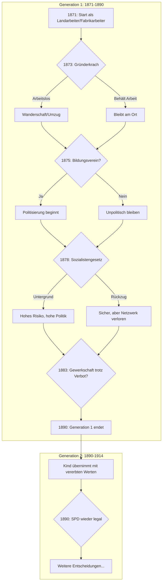

# Familie Schumann — Arbeiter-Storyline

## Gesamtübersicht (Mermaid)



## Biografische Grundlagen

Diese Storyline basiert auf:

| Biografie | Elemente übernommen |
|-----------|---------------------|
| **Moritz Bromme** | Fabrikarbeit, SPD-Engagement, Krankheit, Familienleben |
| **Ottilie Baader** | Heimarbeit, Politisierung, Frauenarbeit |
| **Adelheid Popp** | Kinderarbeit, Selbstbildung, Aktivismus |
| **Franz Rehbein** | Landarbeit, Wanderschaft, Militär |
| **Doris Viersbeck** | Dienstbotenarbeit, Würde vs. Überleben |

## Start-Konfiguration (1871)

```yaml
protagonist:
  name: "August Schumann"
  geburtsjahr: 1850
  alter_1871: 21
  herkunft: "Sachsen, Landarbeitersohn"
  
attribute:
  bildung: 0        # Volksschule besucht
  vermoegen: -20    # Arm, aber nicht verschuldet
  politik: 0        # Unpolitisch
  gesundheit: 20    # Jung und kräftig
  ansehen: 0        # Unauffällig
  solidaritaet: 10  # Dorfgemeinschaft

flags: []
```

---

## Kapitel 1: 1871-1875 — Der Anfang

### [1871-Q1] Die Reichsgründung
**Kontext:** Wilhelm wird zum Kaiser ausgerufen. August ist 21, Landarbeiter auf einem Gut in Sachsen.

> *"Wir erfuhren von der Kaiserproklamation durch den Pfarrer nach dem Gottesdienst. Manche jubelten. Mir war es gleichgültig — der Rübenacker musste trotzdem gehackt werden."*
> — Frei nach Rehbein

**Keine Entscheidung** — Einführungsszene, aber setzt den Ton.

---

### [1871-Q3] Die Landflucht
**Kontext:** Gerüchte von hohen Löhnen in den Fabriken. Augusts Bruder ist bereits nach Chemnitz gezogen.

> *"Die Fabrikarbeiter verdienten in einer Woche, was wir in einem Monat bekamen. Natürlich war die Arbeit anders — aber sie hatten Bargeld in der Tasche."*
> — Frei nach Bromme

**Optionen:**

1. **In die Stadt ziehen** 
   - → Beruf wechselt zu "Fabrikarbeiter"
   - → Vermögen +10 (höherer Lohn)
   - → Ansehen -5 (Entwurzelung)
   - → Gesundheit -5 (Fabrikluft)
   - → Neue Entscheidungsstränge in der Stadt
   
2. **Auf dem Land bleiben**
   - → Beruf bleibt "Landarbeiter"
   - → Vermögen bleibt
   - → Solidarität +10 (Dorfgemeinschaft)
   - → Langsamere Politisierung
   - → Andere Entscheidungsstränge

3. **Nach Amerika auswandern**
   - → ENDE dieses Strangs
   - → Epilog: "Die Schumanns in Amerika"
   - → Vermögen +30 langfristig (wenn erfolgreich)
   - → Familie verloren, neue Geschichte

---

### [1872-Q2] Die Wohnung (nur bei Stadt-Option)
**Kontext:** August ist jetzt in Chemnitz. Er braucht eine Bleibe.

> *"Die Mietskasernen waren Löcher. Sechs Mann in einem Zimmer, der Gestank unbeschreiblich. Aber billiger ging es nicht."*
> — Frei nach Bromme

**Optionen:**

1. **Billige Schlafstelle (Männerheim)**
   - → Vermögen +5 (Ersparnis)
   - → Gesundheit -10 (schlechte Verhältnisse)
   - → Solidarität +15 (Kameradschaft)
   - → Kontakt zu politischen Arbeitern

2. **Teurere Kammer alleine**
   - → Vermögen -10
   - → Gesundheit +5
   - → Solidarität -5 (isoliert)
   - → Heiratsmöglichkeit früher

3. **Beim Bruder unterkommen**
   - → Vermögen +0
   - → Solidarität +20 (Familie)
   - → Abhängigkeit, aber Sicherheit

---

### [1873-Q2] Der Gründerkrach
**Kontext:** Die Börse bricht zusammen. Fabriken schließen.

> *"Von einem Tag auf den anderen war die Arbeit weg. Wir standen vor dem Tor und warteten — aber es blieb geschlossen."*
> — Frei nach Popp

**Optionen (bei Fabrikarbeiter):**

1. **Arbeit in anderer Stadt suchen**
   - → Vermögen -15 (Reise, Unsicherheit)
   - → 50% Chance: Arbeit finden → Vermögen +10
   - → 50% Chance: Wanderarbeit → Gesundheit -10
   - → Neue Kontakte (Solidarität +10)

2. **Vor Ort bleiben und warten**
   - → Vermögen -20 (keine Einnahmen)
   - → Gesundheit -5 (Hunger)
   - → 70% Chance: Fabrik öffnet nach 3 Monaten
   - → 30% Chance: Armenhaus droht

3. **Streikbrecher werden**
   - → Vermögen +15 sofort
   - → Ansehen -40 (bei Arbeitern)
   - → Solidarität -30
   - → Politik -20
   - → Wird später nicht vergessen!

**Optionen (bei Landarbeiter):**
- Landarbeit ist stabiler, aber Lohn sinkt
- Option: Saisonarbeit in der Stadt

---

### [1874-Q4] Die Frau
**Kontext:** August ist jetzt 24. Zeit für eine Familie?

> *"Ich lernte Anna beim Tanz im Wirtshaus kennen. Sie arbeitete in der Weberei. Ihr Lachen gefiel mir, und sie verstand, was Arbeit bedeutet."*
> — Frei nach Bromme

**Optionen:**

1. **Anna heiraten (Liebesehe)**
   - → Setzt Flag: LIEBESEHE
   - → Solidarität +15 (gemeinsam stark)
   - → Vermögen -10 (Hochzeit, eigene Wohnung)
   - → Anna bringt eigene Story mit (Weberin, politisch interessiert)

2. **Martha heiraten (Vernunftehe)**
   - → Vermögen +10 (sie hat etwas gespart)
   - → Solidarität +5
   - → Martha ist unpolitisch, konservativ
   - → Spannungen bei politischer Aktivität später

3. **Noch nicht heiraten**
   - → Bleibt flexibel
   - → Risiko: Isolation
   - → Kann später noch entscheiden

---

### [1875-Q2] Der Bildungsverein
**Kontext:** Ein Kollege lädt August zum Arbeiterbildungsverein ein.

> *"Im Bildungsverein lernte ich zum ersten Mal, dass unsere Lage nicht gottgewollt, sondern gemacht ist — und also änderbar."*
> — Ottilie Baader

**Optionen:**

1. **Regelmäßig hingehen**
   - → Bildung +15
   - → Politik +10
   - → Ansehen +5 (in Arbeiterkreisen)
   - → Neue Kontakte (SPD, Gewerkschaft)
   - → Anna (wenn verheiratet): Entweder mitbegeistert oder besorgt

2. **Einmal hingehen, dann aufhören**
   - → Bildung +5
   - → Politik +5
   - → Samen ist gepflanzt für später

3. **Ablehnen ("Ich hab keine Zeit")**
   - → Alles bleibt
   - → Weniger Optionen später
   - → Aber: Familie zufrieden

---

### [1875-Q3] Das Gothaer Programm
**Kontext:** Die Arbeiterparteien vereinigen sich zur SPD. August hat davon gehört (wenn Bildungsverein: direkt erfahren).

> *"Zum ersten Mal hatten wir eine eigene Partei. Nicht die der Fabrikanten, nicht die des Kaisers — unsere."*
> — Frei nach Bebel

**Optionen (nur wenn Politik > 5 oder Bildung > 10):**

1. **SPD beitreten**
   - → Setzt Flag: SPD_MITGLIED
   - → Politik +15
   - → Solidarität +15
   - → Ansehen +10 (Arbeiter) / -10 (Bürgerliche)
   - → Risiko bei Sozialistengesetz!

2. **Sympathisant bleiben (kein Mitglied)**
   - → Politik +10
   - → Solidarität +5
   - → Weniger Risiko, weniger Einfluss

3. **"Politik ist nicht meine Sache"**
   - → Alles bleibt
   - → Frau (wenn konservativ) zufrieden

---

## Kapitel 2: 1876-1880 — Das Sozialistengesetz

### [1878-Q2] Die Attentate
**Kontext:** Attentate auf den Kaiser. Alle reden davon.

> *"Nach den Attentaten wurden die Blicke schärfer. Jeder, der ein Buch las, war verdächtig."*
> — Frei nach Bromme

**Keine Entscheidung** — Stimmungsszene, Vorbereitung.

---

### [1878-Q4] Das Sozialistengesetz tritt in Kraft
**Kontext:** SPD verboten. Zeitungen verboten. Vereine aufgelöst.

> *"Eines Morgens stand die Polizei vor der Tür. Sie nahmen alles mit — Bücher, Zeitungen, sogar die Briefe."*
> — Bromme

**Optionen (wenn SPD_MITGLIED):**

1. **Im Untergrund weitermachen**
   - → Politik +20
   - → Ansehen +15 (in der Bewegung)
   - → RISIKO: Jedes Quartal 20% Chance auf Verhaftung
   - → Bei Verhaftung: Gesundheit -20, Vermögen -30, aber Solidarität +20

2. **Rückzug, aber Kontakt halten**
   - → Politik +5
   - → Solidarität +5
   - → Kein direktes Risiko
   - → Kann später wieder aktiv werden

3. **Vollständiger Rückzug**
   - → Politik -10 (Enttäuschung)
   - → Solidarität -20 (Netzwerk verloren)
   - → Sicher, aber isoliert

**Optionen (wenn nicht SPD_MITGLIED):**

1. **Jetzt beitreten (Trotz)**
   - → Setzt Flag: SPD_MITGLIED
   - → Politik +25 (Radikalisierung)
   - → "Jetzt erst recht!"

2. **Erleichtert sein ("Gut, dass ich nicht dabei war")**
   - → Politik -5
   - → Sicher bleiben

---

### [1879-Q1] Die Hausdurchsuchung (wenn Untergrund)
**Kontext:** Polizei kommt zur Hausdurchsuchung.

> *"Unter den Dielenbrettern lagen die verbotenen Zeitungen. Mein Herz schlug so laut, ich war sicher, sie würden es hören."*

**Optionen:**

1. **Versteck hält**
   - → 60% Erfolgschance
   - → Erfolg: Solidarität +10 (Erleichterung, Netzwerk bestätigt)
   - → Misserfolg: Siehe "Verhaftung"

2. **Selbst verraten um Familie zu schützen**
   - → Setzt Flag: HAT_GEFAENGNIS_ERFAHRUNG
   - → Gesundheit -15, Vermögen -20
   - → Politik +10 (Märtyrer)
   - → Familie bleibt sicher

3. **Auf Nachbarn schieben**
   - → Moralisch: Sehr problematisch
   - → Ansehen -50 (wenn rauskommt)
   - → Solidarität -40
   - → Persönlich sicher, aber innerlich zerstört

---

### [1879-Q3] Die Ausweisung (wenn Untergrund + hohe Politik)
**Kontext:** Der "kleine Belagerungszustand". August soll die Stadt verlassen.

> *"24 Stunden Zeit. Meine Frau weinte, die Kinder verstanden nicht. Am Bahnhof ein letzter Blick."*
> — Frei nach Baader

**Optionen:**

1. **Gehen (ins Exil oder andere Stadt)**
   - → Setzt Flag: HAT_EXIL_ERFAHRUNG
   - → Familie bleibt zurück oder kommt mit
   - → Vermögen -30
   - → Politik +10 (internationale Kontakte)
   - → Neue Handlungsstränge im Exil

2. **Untertauchen (illegal bleiben)**
   - → HOHES RISIKO: 40% Verhaftung pro Quartal
   - → Politik +20
   - → Solidarität +20 (Genossen helfen)
   - → Gesundheit -10 (Stress)

3. **Sich stellen und "bekehren"**
   - → Politik -30
   - → Ansehen -30 (bei Genossen)
   - → Darf bleiben
   - → Inner conflict für Rest des Lebens

---

### [1880-Q2] Das Kind
**Kontext:** Erstes Kind wird geboren (wenn verheiratet).

> *"Als ich meinen Sohn zum ersten Mal sah, wusste ich: Für ihn kämpfe ich. Er soll es besser haben."*

**Keine Entscheidung** — Aber wichtig für Motivation und Generation 2.

- → Setzt Flag: HAT_KINDER
- → Vermögen -10 (mehr Ausgaben)
- → Solidarität +10 (Familienbande)
- → Kind wird Generation 2

---

## Kapitel 3: 1881-1890 — Die langen Jahre

### [1883-Q2] Die Krankenversicherung
**Kontext:** Das neue Gesetz tritt in Kraft.

> *"Zum ersten Mal konnte ich krank sein, ohne Angst zu haben, dass die Familie verhungert."*

**Keine Entscheidung** — Aber Auswirkung:
- → Wenn Gesundheit < 0: Jetzt Behandlung möglich
- → Gesundheit +10 (durch System)
- → Politik +5 (Staat tut etwas Gutes?) oder -5 (Bestechung!)

---

### [1884-Q3] Der Streik
**Kontext:** Trotz Verbot organisieren Arbeiter einen Streik.

> *"Wir wussten, was auf dem Spiel stand. Aber der Lohn war zu niedrig, die Stunden zu lang."*

**Optionen:**

1. **Mitmachen**
   - → Setzt Flag: HAT_STREIK_TEILNAHME
   - → 50% Erfolg: Lohn +10%, Ansehen +15
   - → 50% Misserfolg: Entlassung, Vermögen -25
   - → Politik +10

2. **Nicht mitmachen, aber nicht verraten**
   - → Neutral bleiben
   - → Ansehen -5 (bei Streikenden)

3. **Streikbrecher**
   - → Vermögen +20
   - → Ansehen -50 (bei Arbeitern)
   - → Solidarität -40
   - → Wird nie vergessen!

---

### [1887-Q4] Die Berufsfrage für den Sohn
**Kontext:** Der Sohn (7 Jahre) — welche Zukunft?

> *"Ich wollte, dass mein Sohn lesen lernt. Richtig lesen, nicht nur die Fibel."*

**Optionen:**

1. **Schule so lange wie möglich**
   - → Kind Bildung +15
   - → Vermögen -10 (Verdienstausfall)
   - → Kind hat bessere Chancen

2. **Früh arbeiten schicken**
   - → Vermögen +10
   - → Kind Gesundheit -10
   - → Kind Bildung -10
   - → Reproduktion der Armut

3. **Lehre suchen**
   - → Kind Bildung +5
   - → Vermögen +5 (Lehrlingslohn)
   - → Kind hat Beruf später

---

### [1890-Q1] Das Ende des Sozialistengesetzes
**Kontext:** Das Gesetz läuft aus. SPD wieder legal.

> *"Wir konnten es kaum glauben. 12 Jahre — und wir hatten überlebt. Jetzt konnte es richtig losgehen."*

**Optionen (wenn Untergrund oder Exil):**

1. **Triumphale Rückkehr**
   - → Ansehen +30
   - → Politik +10
   - → Kandidatur für Parteiamt möglich

2. **Leise zurückkehren**
   - → Ansehen +10
   - → Ruhe nach den Jahren

**Markiert ENDE GENERATION 1**

---

## Übergang zu Generation 2

Der Sohn (jetzt ca. 10-15 Jahre) übernimmt als Protagonist.

Er erbt:
- 50% der Attributwerte der Eltern
- Die Narrative (Geschichten, die er gehört hat)
- Die Flags (indirekt: "Mein Vater war im Gefängnis")

Neue Start-Situation abhängig von allen Entscheidungen:

```yaml
# Beispiel: Politische Familie
generation: 2
protagonist:
  name: "Karl Schumann"
  geburtsjahr: 1880
  
basis_von_eltern:
  bildung: 7      # (Eltern 15 × 0.5 = 7.5)
  vermoegen: -5   # (Eltern -10 × 0.5)
  politik: 17     # (Eltern 35 × 0.5)
  
narrative:
  - "Vater war 1878 im Untergrund"
  - "Familie hat Sozialistengesetz überlebt"
  - "Mutter war auch in der Bewegung aktiv"
```
